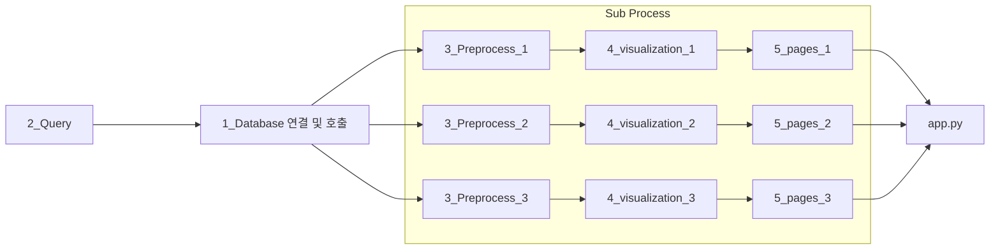

## 코드 흐름

## 폴더별 정의

## 폴더 트리
your_project/
├── _1_database/
│   ├── base_connector.py
│   ├── snowflake_connector.py
│   └── oracle_connector.py
│
├── _2_query/
│   ├── defect_rate.sql
│   ├── defect_by_line.sql
│   └── ...
│
├── _3_preprocessing/****
│   ├── config.py
│   ├── defect_rate.py
│   └── defect_by_line.py
│
├── _4_visualization/
│   ├── config.py
│   ├── defect_rate.py
│   └── defect_by_line.py
│
├── _5_pages/
│   ├── 1_📈_Defect_Rate.py
│   ├── 2_🧪_Line_Comparison.py
│   └── ...
│
├── _6_helpers/
│   ├── formatter.py
│   └── validator.py
│
├── _7_assets/
│   └── logo.png
│
└── main.py

관련이 있는 CTE문과 쿼리문은 한 파일에서 관리를 한다.
config, const, helper 정의
db_client 파일을 만들어 사용(snowflake, orcle, sqlite)
init.py에 추가하면 경로문제가 없다고 한다. 꼭 Test 해볼것
그리고 from...import... 구문을 작성할때 root 기준 절대경로를 작성할 것 

## Coding's Rules
- 100~300 줄 코드로 유지
- 관련이 있는 config & helper은 폴더내에 작성 / 전체 공통항목은 통합 구성
- preprocess - visualization - page 는 페어로 관리하고, 파일명은 _000_으로 시작한다.

your_project/
├── _1_database/
├── _2_query/
├── _3_preprocessing/****
├── _4_visualization/
├── _5_pages/
├── _6_helpers/
├── _7_assets/
└── main.py

1️⃣ _1_database/ - DB 연결 및 관리
이 폴더는 DB와의 연결을 관리하는 클래스, 설정 파일 등을 포함합니다.

2️⃣ _2_query/ - DB 쿼리 실행 관련
쿼리문을 실행할 수 있는 함수들을 관리하는 폴더입니다. 여러 종류의 쿼리를 각 파일로 나누어 관리할 수 있습니다.

3️⃣ _3_preprocessing/ - 데이터 전처리 관련
이 폴더는 데이터를 처리하거나 변환하는 함수들을 관리합니다. 예를 들어, 결측값 처리, 데이터 정규화, 이상치 처리 등을 포함할 수 있습니다.

4️⃣ _4_visualization/ - 데이터 시각화 관련
이 폴더는 데이터를 시각화하는 함수들을 포함합니다. 각종 차트나 그래프를 그릴 수 있는 함수들을 작성합니다.

5️⃣ _5_pages/ - UI 및 페이지 관련 (Streamlit, Dash 등)
이 폴더는 앱의 페이지 및 UI 관련 파일들을 포함합니다. Streamlit을 사용하는 경우, 각 페이지별로 파일을 나누어 관리할 수 있습니다.

6️⃣ _6_helpers/ - 유틸리티 함수
이 폴더는 다양한 보조적인 작업을 수행하는 함수들을 포함합니다. 파일 관리, 로그 기록, 날짜 계산 등 공통적으로 사용될 수 있는 함수들을 작성합니다.

7️⃣ _7_assets/ - 정적 자원
이 폴더는 이미지, CSS, JavaScript 등의 정적 자원을 포함합니다. 웹 앱에서 사용하는 자원들을 여기에 저장할 수 있습니다.